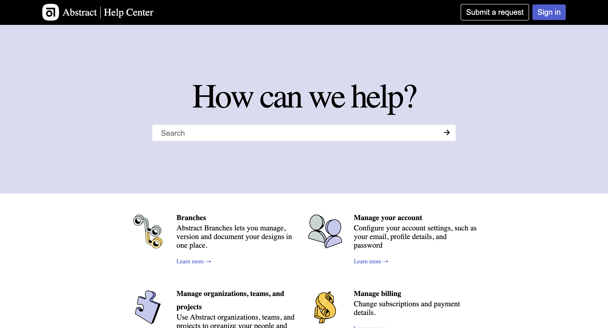
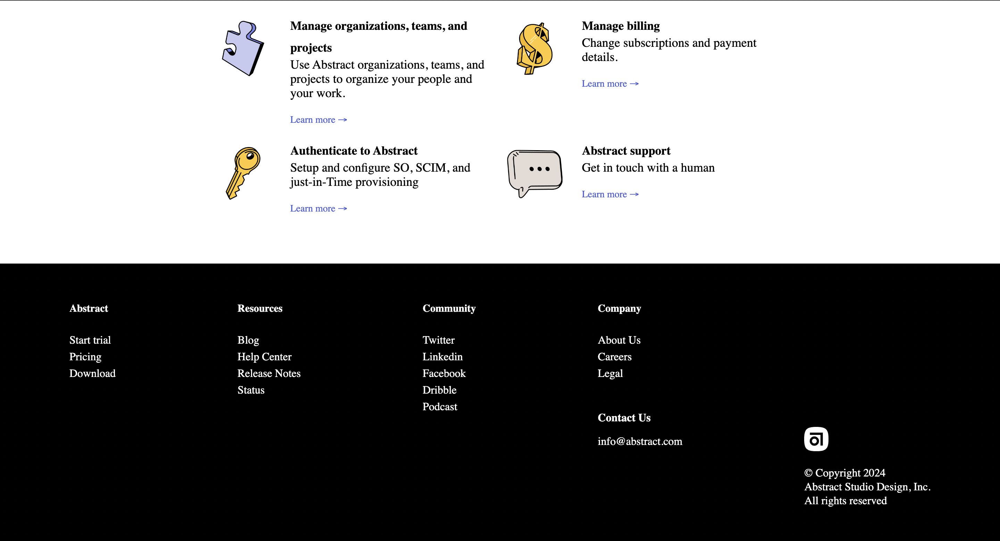
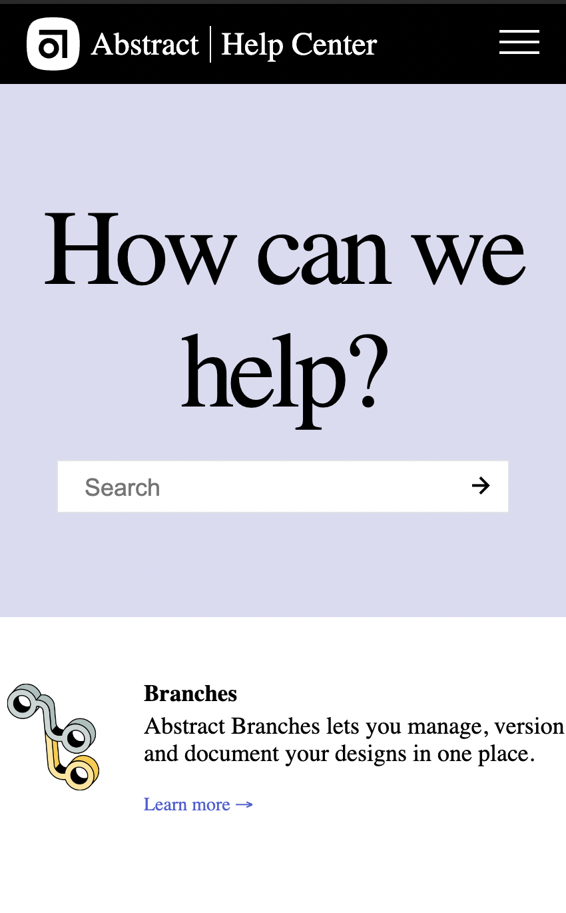
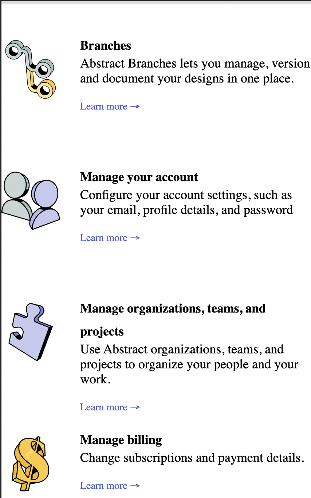
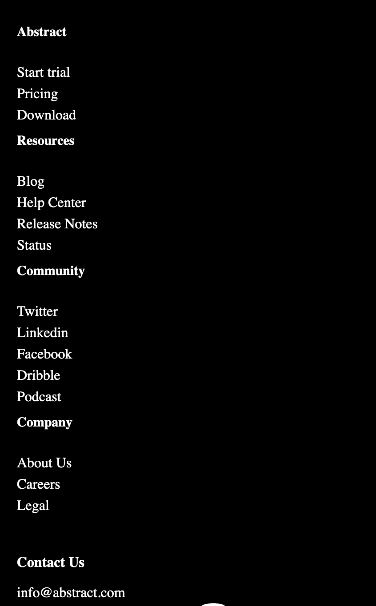

# Abstract Project

Welcome to the Abstract Project! This project is part of the Frontend Practice collection available at [frontendpractice.com](https://www.frontendpractice.com/projects/abstract).

## Overview

The Abstract Project is designed to enhance your frontend development skills by creating a responsive and interactive navigation bar with a hamburger menu. It includes the implementation of a logo, help center link, and buttons for submitting requests and signing in.

## Features

- Responsive navigation bar with a modern and clean design.
- Hamburger menu functionality for better user experience on smaller screens.
- Utilizes HTML, CSS, and JavaScript for a dynamic and interactive interface.
- Incorporates SVG elements for scalable and high-quality graphics.

## Project Structure

- `index.html`: Main HTML file containing the structure of the webpage.
- `style.css`: CSS file for styling the HTML elements.
- `script.js`: JavaScript file for adding interactivity to the navigation bar.

## Screenshots









## Getting Started

1. Clone the repository to your local machine:

   ```bash
   git clone https://github.com/AbdussamadYisau/Frontend-Practice.git

2. Navigate to the particular directory from the terminal
    ```bash
    cd Abstract
    
3. Open the index.html file in your browser using live server or any other method
