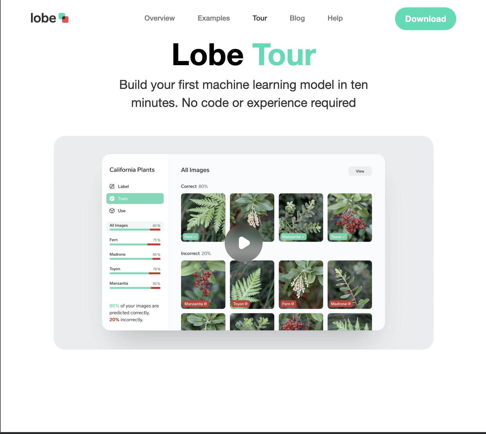
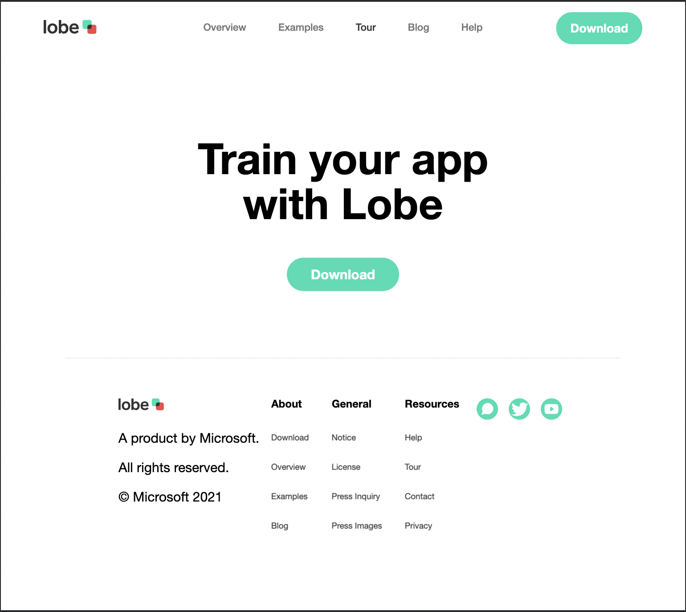
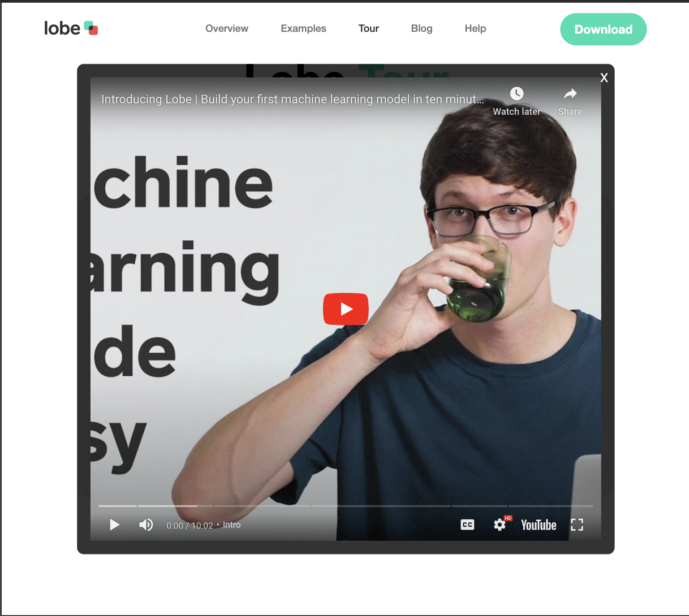
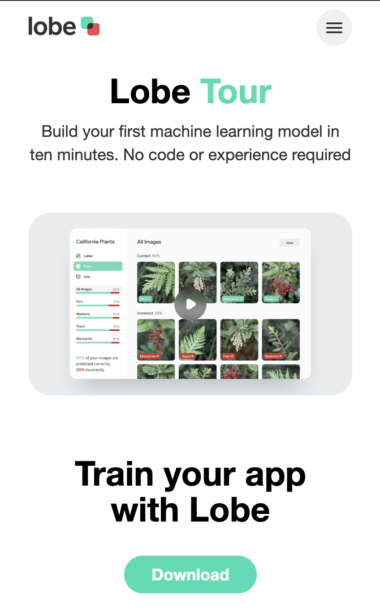
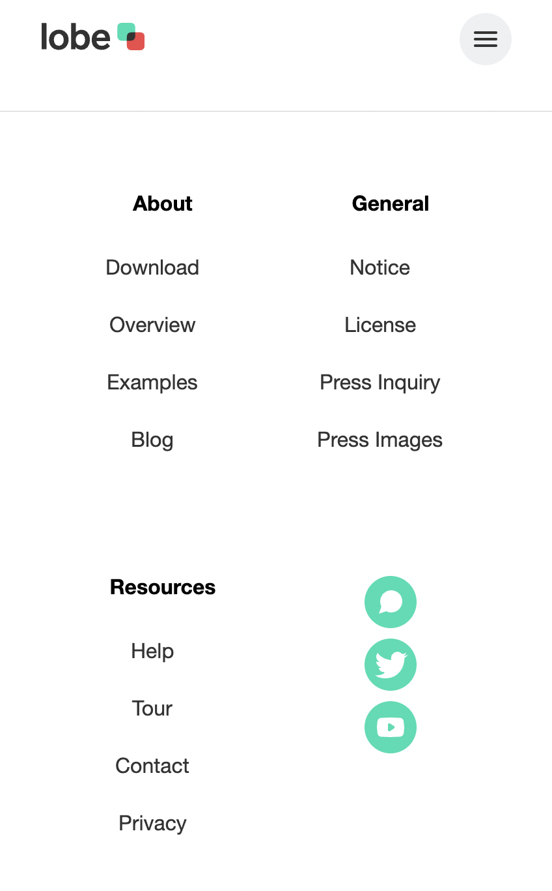
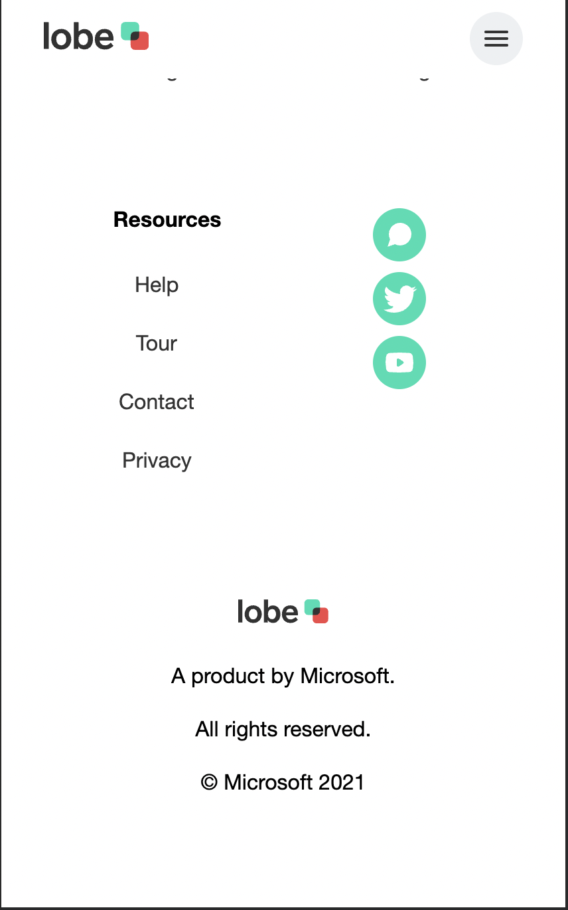
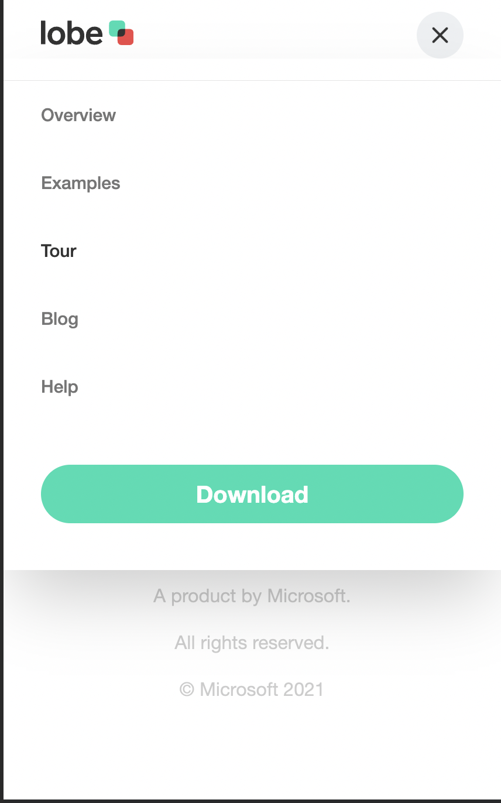

# Project Lobe - Frontend Practice

Welcome to Project Lobe! This project is part of the Frontend Practice series, designed to help you enhance your frontend development skills.

## Overview

Project Lobe is a web page showing the tour section of lobe's website. It includes the implementation of a logo, video overlay and beginner level animations. Here's a link - [here](https://frontend-practice-4dn3.vercel.app/)

## Features

- Responsive navigation bar with a modern and clean design.
- Hamburger menu functionality for better user experience on smaller screens.
- Utilizes HTML, CSS, and JavaScript for a dynamic and interactive interface.
- Incorporates SVG elements for scalable and high-quality graphics.

## Technologies Used

- HTML5
- CSS3
- JavaScript


## Project Structure

- `index.html`: Main HTML file containing the structure of the webpage.
- `style.css`: CSS file for styling the HTML elements.
- `script.js`: JavaScript file for adding interactivity to the navigation bar.

## Screenshots











## Getting Started

1. Clone the repository to your local machine:

   ```bash
   git clone https://github.com/AbdussamadYisau/Frontend-Practice.git

2. Navigate to the particular directory from the terminal
    ```bash
    cd Lobe
    
3. Open the index.html file in your browser using live server or any other method