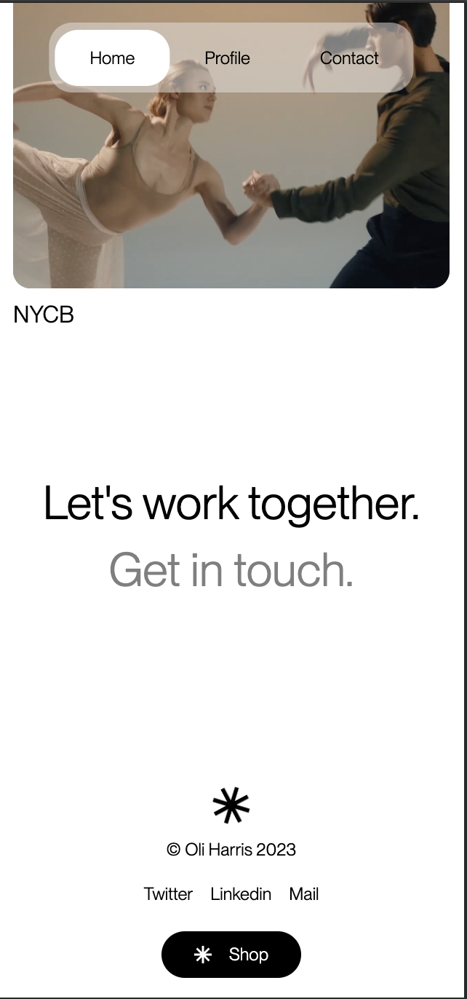

# Project Oh Studio - Frontend Practice

Welcome to Project Oh Studio! This project is part of the Frontend Practice series, designed to help you enhance your frontend development skills.

## Overview

Project Oh Studio is a web page showcasing the tour section of Oh Studio's website. It includes the implementation of a logo, video overlay, and beginner-level animations. Here's a link to the deployed project - [Oh Studio Project](https://frontend-practice-f9ho.vercel.app/)

## Features

- Hover effects.
- Scroll animations.
- Utilizes HTML, CSS, and JavaScript for a dynamic and interactive interface.
- Incorporates SVG elements for scalable and high-quality graphics.

## Technologies Used

- HTML5
- CSS3
- JavaScript

## Project Structure

- `index.html`: Main HTML file containing the structure of the webpage.
- `style.css`: CSS file for styling the HTML elements.
- `script.js`: JavaScript file for adding interactivity to the navigation bar.

## Screenshots





## Getting Started

1. Clone the repository to your local machine:

   ```bash
   git clone https://github.com/AbdussamadYisau/Frontend-Practice/tree/main/OhStudio
   ```

2. Navigate to the particular directory from the terminal:

    ```bash
    cd OhStudio
    ```

3. Open the `index.html` file in your browser using live server or any other method.